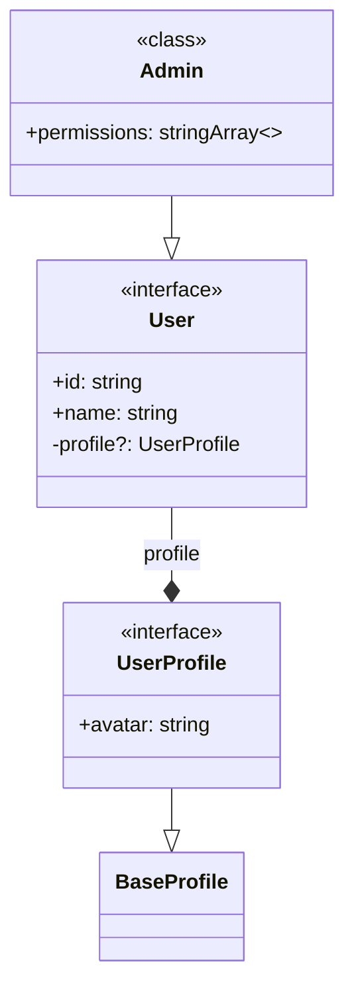

# TypeScript to Mermaid Converter

Convert TypeScript interfaces, types, and classes into Mermaid class diagrams.

## Features

- 🔍 Analyzes TypeScript files using the TypeScript Compiler API
- 🏗️ Detects inheritance, implementation, and composition relationships
- 📊 Generates clean Mermaid class diagram syntax
- 🎯 Handles complex types including unions, generics, and enums
- ⚠️ Continues processing files with syntax errors and marks auto-fixed types
- 📦 Single file solution with minimal dependencies

## Installation

```bash
npm install
```

## Usage

```bash
# Convert and output to console
npm run convert path/to/schema.ts

# Convert and save to file
npm run convert path/to/schema.ts -- --save

# Direct usage
npx ts-node ts-to-mermaid.ts path/to/schema.ts
```

## Example

Input TypeScript:
```typescript
interface User {
  id: string;
  name: string;
  profile?: UserProfile;
}

interface UserProfile extends BaseProfile {
  avatar: string;
}

class Admin extends User {
  permissions: string[];
}
```

Output Mermaid:


## Error Handling

The converter gracefully handles TypeScript files with syntax errors:

- Continues processing despite errors
- Marks auto-fixed types with `⚠️ AUTO-FIXED ⚠️` indicator
- Reports errors as comments in the diagram

Example with syntax error:
```typescript
interface Product {
  id: number;
  name: string;
// Missing closing brace!
```

Output shows:
```mermaid
class Product {
  <<interface>>
  ⚠️ AUTO-FIXED ⚠️
  +id: number
  +name: string
}
```

## Relationship Types

- `--|>` Inheritance (extends)
- `..|>` Implementation (implements)
- `--*` Composition (property reference)
- `--|` Union type member

## Development

```bash
# Build JavaScript output
npm run build

# Run with ts-node (no build needed)
npm run convert path/to/file.ts
```

## License

MIT