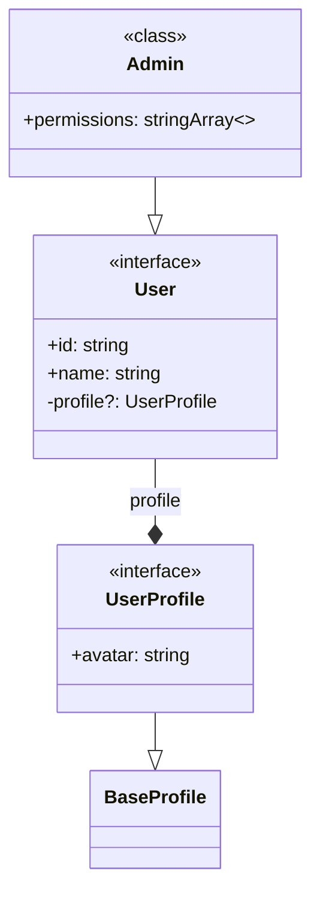

# TypeScript to Mermaid Converter

Convert TypeScript interfaces, types, and classes into Mermaid class diagrams.

## Features

- 🔍 Analyzes TypeScript files using the TypeScript Compiler API
- 🏗️ Detects inheritance, implementation, and composition relationships
- 📊 Generates clean Mermaid class diagram syntax
- 🎯 Smart union type handling based on complexity
- 🔄 Detects and visualizes discriminated unions as inheritance hierarchies
- 📝 Inline annotations for simple unions (≤5 values)
- ⚠️ Continues processing files with syntax errors and marks auto-fixed types
- 📦 Single file solution with minimal dependencies

## Installation

```bash
npm install
```

## Usage

```bash
# Convert and output to console
npm run convert path/to/schema.ts

# Convert and save to file
npm run convert path/to/schema.ts -- --save

# Direct usage
npx ts-node ts-to-mermaid.ts path/to/schema.ts
```

## Example

Input TypeScript:
```typescript
interface User {
  id: string;
  name: string;
  profile?: UserProfile;
}

interface UserProfile extends BaseProfile {
  avatar: string;
}

class Admin extends User {
  permissions: string[];
}
```

Output Mermaid:


## Union Type Handling

The converter intelligently handles different types of unions:

### Simple Unions (≤5 values)
Rendered inline in properties:
```typescript
interface Settings {
  theme: "light" | "dark";
  size: "sm" | "md" | "lg";
}
```
→
```mermaid
class Settings {
  <<interface>>
  +theme: "light" or "dark"
  +size: "sm" or "md" or "lg"
}
```

### Large Unions (>5 values)
Created as enumeration classes:
```typescript
type Status = "active" | "inactive" | "pending" | "suspended" | "archived" | "deleted";
```
→
```mermaid
class Status {
  <<enumeration>>
  "active"
  "inactive"
  "pending"
  "suspended"
  "archived"
  "deleted"
}
```

### Discriminated Unions
Converted to inheritance hierarchies:
```typescript
type Shape = 
  | { kind: "circle"; radius: number }
  | { kind: "rectangle"; width: number; height: number };
```
→
```mermaid
class Shape {
  <<interface>>
  +kind: string
}
class CircleShape {
  <<interface>>
  +kind: "circle"
  +radius: number
}
class RectangleShape {
  <<interface>>
  +kind: "rectangle"
  +width: number
  +height: number
}
CircleShape ..|> Shape
RectangleShape ..|> Shape
```

### Complex Unions
Documented with note annotations:
```typescript
type MixedData = string | number | User | { custom: boolean };
```
→
```mermaid
class MixedData {
  <<enumeration>>
  +value: MixedData
}
note for MixedData "MixedData = string | number | User | Object"
```

## Error Handling

The converter gracefully handles TypeScript files with syntax errors:

- Continues processing despite errors
- Marks auto-fixed types with `⚠️ AUTO-FIXED ⚠️` indicator
- Reports errors as comments in the diagram

Example with syntax error:
```typescript
interface Product {
  id: number;
  name: string;
// Missing closing brace!
```

Output shows:
```mermaid
class Product {
  <<interface>>
  ⚠️ AUTO-FIXED ⚠️
  +id: number
  +name: string
}
```

## Relationship Types

- `--|>` Inheritance (extends)
- `..|>` Implementation (implements)
- `--*` Composition (property reference)
- `--|` Union type member

## Development

```bash
# Build JavaScript output
npm run build

# Run with ts-node (no build needed)
npm run convert path/to/file.ts
```

## License

MIT