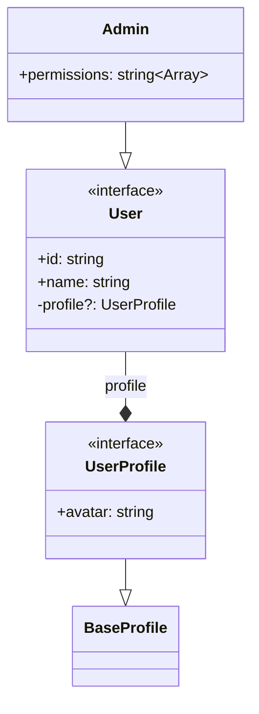

# TypeScript to Mermaid Converter

Convert TypeScript interfaces, types, and classes into Mermaid class diagrams.

## Features

- 🔍 Analyzes TypeScript files using the TypeScript Compiler API
- 🏗️ Detects inheritance, implementation, and composition relationships
- 📊 Generates clean Mermaid class diagram syntax
- 🎯 Handles complex types including unions, generics, and enums
- 📦 Single file solution with minimal dependencies

## Installation

```bash
npm install
```

## Usage

```bash
# Convert and output to console
npm run convert path/to/schema.ts

# Convert and save to file
npm run convert path/to/schema.ts -- --save

# Direct usage
npx ts-node ts-to-mermaid.ts path/to/schema.ts
```

## Example

Input TypeScript:
```typescript
interface User {
  id: string;
  name: string;
  profile?: UserProfile;
}

interface UserProfile extends BaseProfile {
  avatar: string;
}

class Admin extends User {
  permissions: string[];
}
```

Output Mermaid:


## Relationship Types

- `--|>` Inheritance (extends)
- `..|>` Implementation (implements)
- `--*` Composition (property reference)
- `--|` Union type member

## Development

```bash
# Build JavaScript output
npm run build

# Run with ts-node (no build needed)
npm run convert path/to/file.ts
```

## License

MIT