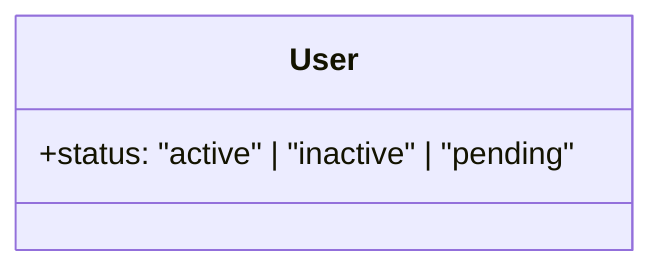
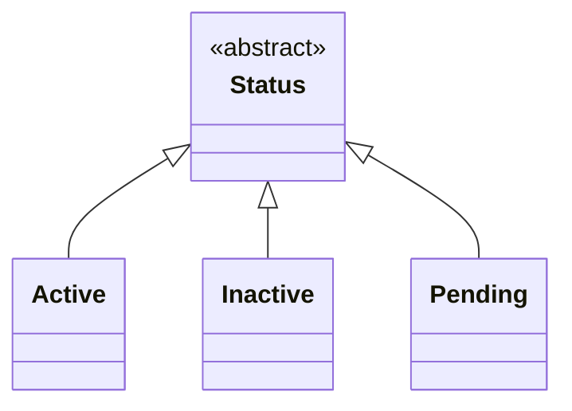
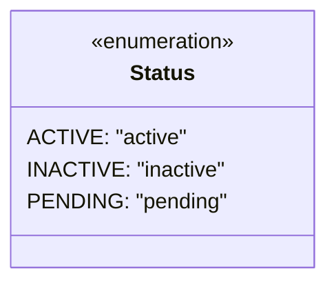
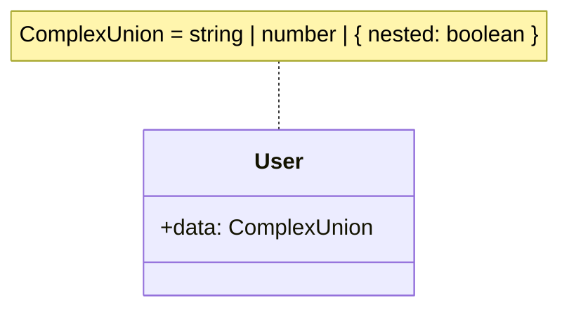
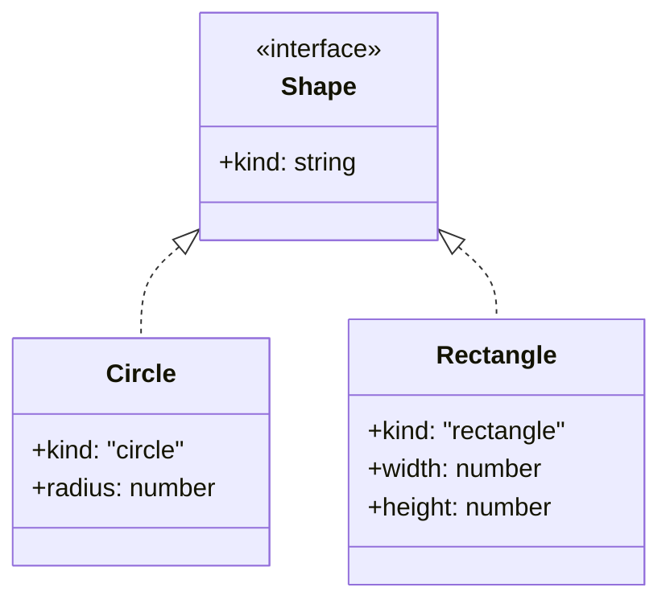

# TypeScript Union to Mermaid Conversion Ruleset

## Comparison of Approaches

### 1. **Inline Annotation**



**Pros:** Most accurate to TypeScript, concise, readable  
**Cons:** Can get unwieldy with many values or complex types

### 2. **Inheritance Hierarchy**



**Pros:** Good for discriminated unions, shows relationships  
**Cons:** Verbose, creates many boxes, overkill for simple unions

### 3. **Enumeration Class**



**Pros:** Reusable, clear for enum-like unions  
**Cons:** Not accurate for complex unions, extra indirection

### 4. **Note Annotation**



**Pros:** Handles any complexity, preserves exact TypeScript syntax  
**Cons:** Separates type info from property, can clutter diagram

## Conversion Rules

### Rule 1: String Literal Unions (≤ 5 values)

```typescript
type Status = "active" | "inactive" | "pending";
```

**→ Use inline annotation:**

```mermaid
+status: "active" | "inactive" | "pending"
```

### Rule 2: String Literal Unions (> 5 values)

```typescript
type Country = 'US' | 'UK' | 'FR' | 'DE' | 'IT' | 'ES' | 'JP' | ...;
```

**→ Use enumeration class:**

```mermaid
class Country {
    <<enumeration>>
    US: "US"
    UK: "UK"
    FR: "FR"
    ...
}
```

### Rule 3: Primitive Type Unions

```typescript
type ID = string | number;
type Nullable<T> = T | null | undefined;
```

**→ Use inline annotation for simple cases:**

```mermaid
+id: string | number
+value: T | null | undefined
```

### Rule 4: Discriminated Unions

```typescript
type Shape =
  | { kind: "circle"; radius: number }
  | { kind: "rectangle"; width: number; height: number };
```

**→ Use inheritance hierarchy:**



### Rule 5: Complex Mixed Unions

```typescript
type Data = string | number | User | { custom: boolean } | null;
```

**→ Use note annotation:**

```mermaid
class MyClass {
    +data: Data
}
note for MyClass "Data = string | number | User | { custom: boolean } | null"
```

### Rule 6: Boolean Unions

```typescript
type Flags = true | false | "maybe";
```

**→ Use inline annotation:**

```mermaid
+flag: true | false | "maybe"
```

### Rule 7: Reusable Type Aliases

```typescript
// Used in multiple places
type UserRole = "admin" | "user" | "guest";
```

**→ Create a dedicated type class:**

```mermaid
class UserRole {
    <<type>>
    "admin" | "user" | "guest"
}
User --> UserRole : role
Post --> UserRole : authorRole
```

### Rule 8: Union with Type Parameters

```typescript
type Result<T> = T | Error;
```

**→ Use note or simplified annotation:**

```mermaid
class Result~T~ {
    <<type>>
}
note for Result "T | Error"
```

### Rule 9: Nested Unions

```typescript
type NestedUnion = (string | number) | (User | Admin);
```

**→ Simplify with note:**

```mermaid
+value: NestedUnion
note "NestedUnion = (string | number) | (User | Admin)"
```

### Rule 10: Function Unions

```typescript
type Handler = ((x: string) => void) | ((x: number) => void);
```

**→ Use note annotation:**

```mermaid
+handler: Handler
note "Handler = ((x: string) => void) | ((x: number) => void)"
```

## Quick Decision Tree

1. **Is it a discriminated union?** → Use inheritance
2. **Is it > 5 string literals?** → Use enumeration
3. **Is it ≤ 5 simple values?** → Use inline annotation
4. **Is it reused multiple times?** → Create dedicated type class
5. **Is it complex/mixed types?** → Use note annotation
6. **Default** → Use inline annotation

## Summary

This ruleset prioritizes diagram readability while maintaining as much type information as possible. The key principle is to match the complexity of the representation to the complexity of the type - simple unions get simple representations, complex unions get more elaborate ones.
