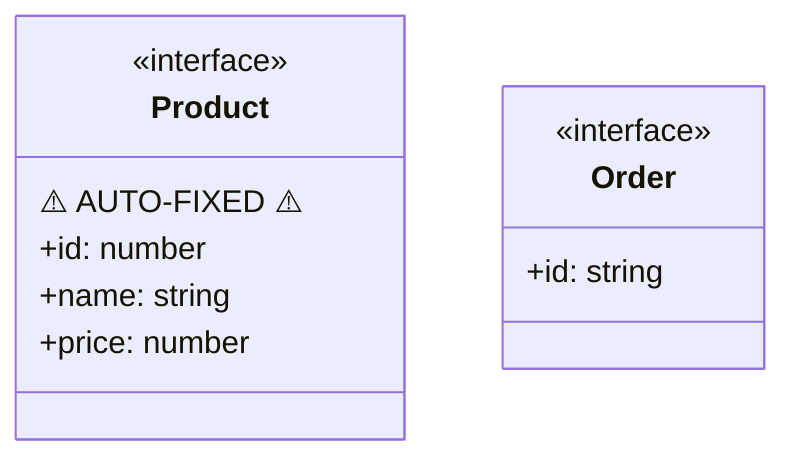

# TypeScript to Mermaid Test Files Documentation

## Overview
This document describes the purpose of each test file in the test suite for the TypeScript to Mermaid converter.

## Existing Test Files

### 1. **basic-types.ts**
- **Purpose**: Tests fundamental TypeScript constructs
- **Coverage**: 
  - Interfaces with basic properties
  - Classes implementing interfaces
  - Enums with string values
  - Inheritance relationships (extends)
  - Implementation relationships (implements)
  - Composition relationships
  - Optional and readonly modifiers
  - Arrays as property types

### 2. **relationships.ts**
- **Purpose**: Tests complex type relationships and inheritance patterns
- **Coverage**:
  - Multiple interface inheritance
  - Class inheritance chains
  - Generic interfaces and classes
  - Abstract classes
  - Composition with nested objects
  - Type aliases for object types
  - Union types in properties
  - Complex relationship graphs

### 3. **generic-types.ts**
- **Purpose**: Tests generic type handling
- **Coverage**:
  - Simple generic interfaces
  - Multi-parameter generics
  - Generic constraints (extends)
  - Generic classes
  - Generic type aliases
  - Nested generic types
  - Default generic parameters
  - Concrete implementations of generic interfaces

### 4. **union-types.ts**
- **Purpose**: Tests union type representation
- **Coverage**:
  - String literal unions
  - Number literal unions
  - Mixed type unions
  - Union types with null/undefined
  - Complex object unions
  - Nested unions
  - Union types used in interfaces and classes

### 5. **comments-test.ts**
- **Purpose**: Tests handling of various comment styles
- **Coverage**:
  - JSDoc comments
  - Single-line comments
  - Multi-line comments
  - Deprecated annotations
  - Comments on properties
  - Comments on types and interfaces

### 6. **test-exports.ts**
- **Purpose**: Tests export syntax handling
- **Coverage**:
  - Named exports
  - Default exports
  - Export statements
  - Re-exports
  - Various export syntaxes

### 7. **schema.ts**
- **Purpose**: Tests a real-world complex schema (JSON-RPC types)
- **Coverage**:
  - Large-scale type definitions
  - Complex nested interfaces
  - Type unions and intersections
  - Constants and literal types
  - Optional properties
  - Documentation comments

### 8. **intersection-types.ts**
- **Purpose**: Test intersection type handling
- **Coverage**:
  - Basic intersection of two interfaces
  - Multiple intersections
  - Intersection with object literals
  - Intersections with generics
  - Property conflicts in intersections
  - Classes implementing intersection types

### 9. **method-signatures.ts**
- **Purpose**: Test method signatures in interfaces and classes
- **Coverage**:
  - Simple method signatures
  - Methods with optional/rest parameters
  - Generic methods
  - Method overloads
  - Private/protected/static methods
  - Abstract methods
- **Note**: Methods are currently not rendered in the diagram (known limitation)

### 10. **namespace-modules.ts**
- **Purpose**: Test namespace and module declarations
- **Coverage**:
  - Basic namespaces
  - Nested namespaces
  - Namespace exports
  - Types using namespace references
  - Module patterns

### 11. **mapped-conditional-types.ts**
- **Purpose**: Test advanced TypeScript features
- **Coverage**:
  - Mapped types (Readonly, Partial, etc.)
  - Conditional types
  - Template literal types
  - Utility types
  - Type inference with infer keyword
  - Recursive types

### 12. **circular-dependencies.ts**
- **Purpose**: Test handling of circular type dependencies
- **Coverage**:
  - Self-referencing types
  - Mutual dependencies between types
  - Three-way circular dependencies
  - Circular references through arrays
  - Graph structures with cycles

### 13. **compilation-errors.ts** (Temporary Test File)
- **Purpose**: Test error recovery for non-compiling TypeScript files
- **Coverage**:
  - Missing type imports
  - Syntax errors in interfaces
  - Undefined base classes
  - Invalid property syntax
  - Duplicate enum values
- **Expected Output**: Partial diagram with error report comments

### 14. **simple-errors.ts**
- **Purpose**: Demonstrate partial parsing with minor syntax errors
- **Coverage**:
  - Missing closing braces in interfaces
  - Missing parameter types in methods
  - Missing commas between properties
  - References to types with errors
- **Expected Output**: Complete diagram with AUTO-FIXED indicators

## Validation Strategy

For each test file:
1. Run the converter on the test TypeScript file
2. Compare output with expected `.mermaid` file in `outputs/` directory
3. Verify the diagram renders correctly in a Mermaid viewer
4. Check that all types, relationships, and modifiers are properly represented

## Error Handling and AUTO-FIXED Indicators

When the converter encounters TypeScript files with syntax errors, it will:

1. **Continue processing** - The TypeScript parser automatically recovers from many syntax errors
2. **Mark auto-fixed types** - Types that had syntax errors show a warning indicator
3. **Report errors** - Error messages appear as comments at the top of the diagram

### Example AUTO-FIXED Output

Given this TypeScript with a missing closing brace:
```typescript
interface Product {
  id: number;
  name: string;
  price: number;
// Missing closing brace!

interface Order {
  id: string;
}
```

The converter produces:


The `⚠️ AUTO-FIXED ⚠️` line clearly indicates that this type had syntax errors that were automatically corrected.

## Known Limitations and Unsupported TypeScript Features

The following TypeScript syntax and patterns are currently **not supported** or have limited support:

### 1. **Method Signatures**
- Method declarations in interfaces/classes are detected but not rendered
- Function overloads are not displayed
- Constructor signatures are omitted
- Getter/setter accessors are not shown

### 2. **Advanced Type Constructs**
- **Conditional Types**: `T extends U ? X : Y` - shown as simple type aliases
- **Mapped Types**: `{ [K in keyof T]: T[K] }` - shown without property mappings
- **Template Literal Types**: `` `prefix${T}` `` - treated as regular strings
- **Tuple Types**: `[string, number, boolean]` - shown as arrays
- **Index Signatures**: `{ [key: string]: any }` - partially supported

### 3. **Utility Types**
- Built-in utility types like `Partial<T>`, `Required<T>`, `Pick<T, K>` show as references
- The actual type transformations are not expanded in the diagram

### 4. **Module System**
- ES6 imports/exports are parsed but import relationships are not shown
- Module augmentation is not supported
- Namespace merging is not handled

### 5. **Decorators**
- Class, method, and property decorators are ignored
- Decorator metadata is not processed

### 6. **Type Inference**
- Inferred types from implementations are not shown
- Type inference from generic constraints is limited
- Contextual typing is not represented

### 7. **Complex Generic Patterns**
- Higher-kinded types
- Generic parameter defaults may not display correctly
- Variadic tuple types

### 8. **JavaScript Constructs**
- JSX/TSX syntax is not supported
- JavaScript files (.js) with JSDoc type annotations

### 9. **Other Limitations**
- Private/protected members in classes (shown as public)
- Static members are not distinguished from instance members
- Abstract members are not marked differently
- Type guards and type predicates
- Assertion functions
- Module resolution (all types treated as if in same file)

### Workarounds

For unsupported features, consider:
1. Simplifying complex types into interfaces or type aliases
2. Documenting complex relationships in comments
3. Breaking down files with heavy use of unsupported features
4. Using the error reporting feature to identify problematic constructs